# NYC Taxi Data Platform

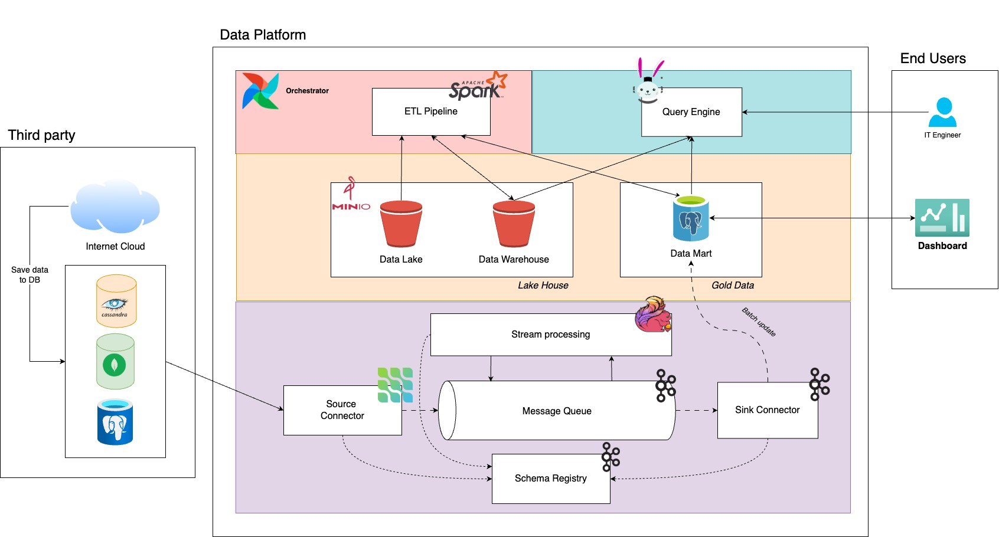
Figure 1: Architecture of the system.

## Table of Contents
- [Section 1: Dataset](#section-1-dataset)
- [Section 2: Architecture Overview](#section-2-architecture-overview)
- [Section 3: Offline Pipeline](#section-3-offline-pipeline)
- [Section 4: Online Pipeline](#section-4-online-pipeline)
- [Section 5: Conclusion](#section-5-conclusion)

## Section 1: Dataset

### a) Overview

The **NYC Taxi dataset** is a large public transportation dataset released by the NYC Taxi & Limousine Commission(TLC). It captures detailed trip-level records for licensed vehicles operating in **New York City**, and it is widely used for data engineering, analytics, transportation research, and machine learning benchmarking.

The dataset is typically divided into three major trip types:

| **Vehicle Type** | **Description** |
| --- | --- |
| 🚕 **Yellow taxi** | • Represents traditional street-hail taxis that mainly operate in **Manhattan** and at major airports.
| |• Trips are usually shorter and denser in central business districts.
| |• Contains detailed fare breakdowns (tax, tolls, surcharges). |
| 🚕 **Green Taxi** | • Also called **Boro taxis**, designed to improve service in outer boroughs (Brooklyn, Queens, Bronx, Staten Island).
| |• Schema is almost identical to Yellow Taxi, with minor differences in some historical fields.
| |• Useful for studying geographic service coverage and demand outside Manhattan. |
| 🚕 **For-Hire Vehicles (FHV)** | • Includes dispatch-based vehicles such as ride-hailing and black car services.
| |• Focuses more on dispatch and location information rather than fare breakdown.
| |• Often used to analyze mobility patterns and platform-based transportation demand. |

### b) Schemas

Yellow & Green Taxi

| Feature name | Description | Value type |
| --- | --- | --- |
| vendor_id | Provider that recorded the trip | categorical (int/string) |
| pickup_datetime | Trip start timestamp | timestamp |
| dropoff_datetime | Trip end timestamp | timestamp |
| passenger_count | Number of passengers | integer |
| trip_distance | Trip distance in miles | float |
| ratecode_id | Rate type applied (standard, JFK, etc.) | categorical (int) |
| store_and_fwd_flag | Whether record was stored before sending | boolean/string |
| pickup_location_id | TLC taxi zone ID for pickup | integer |
| dropoff_location_id | TLC taxi zone ID for dropoff | integer |
| payment_type | Payment method (cash, card, etc.) | categorical (int) |
| fare_amount | Base fare | float |
| extra | Extra surcharges | float |
| mta_tax | MTA tax amount | float |
| tip_amount | Tip paid | float |
| tolls_amount | Tolls paid | float |
| improvement_surcharge | TLC improvement fee | float |
| total_amount | Total trip cost | float |
| congestion_surcharge | Congestion pricing fee | float |

For-Hire Vehicle (FHV)

| Feature name | Description | Value type |
| --- | --- | --- |
| dispatching_base_num | TLC base license number | string |
| affiliated_base_num | Affiliated base (if any) | string |
| pickup_datetime | Trip pickup timestamp | timestamp |
| dropoff_datetime | Trip dropoff timestamp | timestamp |
| pickup_location_id | Pickup taxi zone | integer |
| dropoff_location_id | Dropoff taxi zone | integer |
| sr_flag | Shared ride indicator | boolean/int |

### c) Online Feature

Beside provided features above, we further compute **real-time (or near-real-time) derived features** computed from trip streams of the NYC Taxi dataset. These features would be useful for Demand forecasting & surge prediction, Mobility pattern analysis, etc.

| **Feature** | **Description** | **Implementation** |
| --- | --- | --- |
| Demand per Zone | Total of demand in a zone over a period of time. | Count num requests within a pulocationid using sliding Window. |
| Fleet Composition per Zone | Proportion of vehicle types currently active in a zone. This can indicate whether this region a 1) Tourist areas (more Yellow) 2) Outer boroughs (more Green/FHV) or 3) App-based dominance (FHV share rising) | % of Green, Yellow, FHV vehicles in a zone over last period of time. |
| Net Flow of Vehicles Between Zones | Directional movement signal indicating whether vehicles are accumulating or leaving an area. E.g Negative flow = vehicles leaving (potential shortage), positive = influx. | For each zone pair (origin → destination): Compute Net flow = (Outgoing trips) - (Incoming trips) over last hour. |
| Congestion Proxy via Recent Trip Speeds | Real-time congestion indicator derived from observed travel speeds. For example, Low average speed → high congestion. | Compute average speed of completed trips (distance / duration) ending in last 30 min in a zone. |


## Section 2: Architecture Overview

This system comprises three main components

### **a) Data sources**:

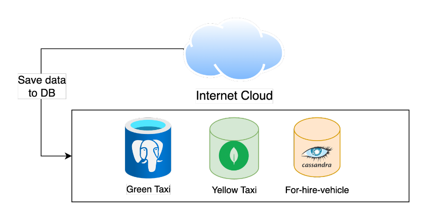

Figure 2: Data sources Architecture.

This component contains:  1) **Websites** for us to download dataset, 2) Three databases that we simulate the providers of each source (green, yellow, for hire vehicle) are independent, and each use their owned database. The architecture is illustrated in the figure. For the database, specifically, we simulate:

1. PostgreSQL for Green Taxi provider.
2. MongoDB for Yellow Taxi provider.
3. Cassandra for For-Hire-Vehicle provider.

Our system should utilize both 1) offline dataset, that Websites has stored, compressed for all three sources, and 2) Capture real-time data that constantly insert into their database, so we can compute online features.


### b) Offline Pipeline

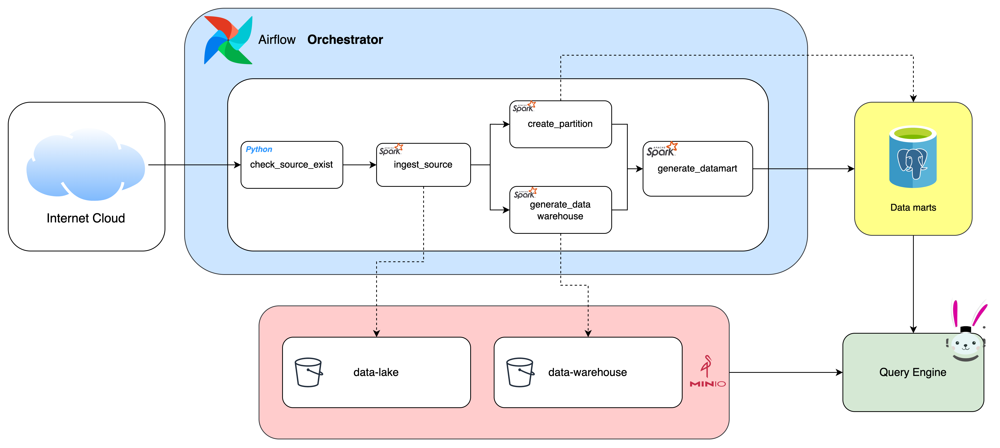

Figure 3: Overview of offline data pipeline.

In this component, we design a workflow that ingests offline data on the website, and step by step inserting and transforming them into Data Lake (Bronze), Data warehouse (Silver), and finally data mart (golden), where data analyst team could visualize and bring value to business.

Specifically, we utilize Airflow as an orchestration while all the computation is based on Apache Spark. The data at bronze and silver are stored on Minio in Parquet format for storage optimization. At the final stage, we ingest the datamart in PostgreSQL, so data could be fetched data faster.

Business-targeted users (e.g Data Analyst Team) could use their Visualization tool (e.g Superset) to fetch data from PostgreSQL. Development users could inspect, fetch data in Data Lake, Data Warehouse, or even PostgreSQL via Trino Query Engine.

### c) Online pipeline

This component aims at streaming data (which constantly inserts into Source databases), parsing, transforming, computing online features in real-time, then inserting it into online feature table within Data Mart.

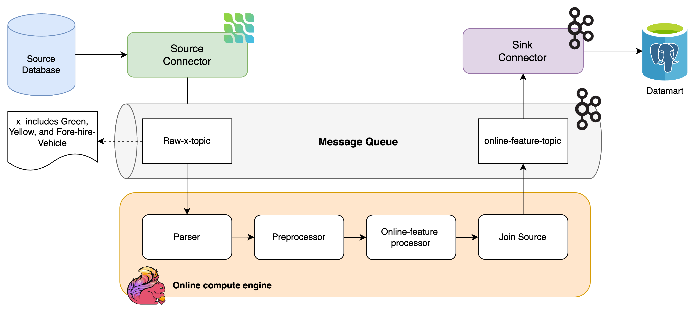
Figure 4: Overview of online data pipeline.

Specifically, given records constantly inserted into source databases (PostgreSQL, MongoDB, and Cassandra), we use Debezium - a platform for change data capture - to capture recent new record with its content and insert into Raw-x-topic.

Given messages within a topic, we design a streaming computation pipeline based on Flink, to fetch messages from topic, parsing message with my desired format, computing online feature using window aggregation technique, joining multiple sources before inserting it back into online-feature-topic.

Finally, we use Kafka Connect as a sink connector to insert online-feature records into datamart.


## Section 3: Offline Pipeline

### A. Overview

In this section, we would start up these services:

Storage Layer:

1. Minio: An object storage, that we would store data for our data lake, and data warehouse.
2. Datamart: This is a PostgreSQL, that we would store both data transformed from warehouse, and online features.

Compute Layer:

1. Hive metadata store, metadata db, Trino: Trino and its corresponding services, where development team would connect and fetch data from all stages (data-lake, data warehouse, and data mart).
2. Spark Cluster: We hosts a spark cluster, so the orchestrator could submit task into.

Orchestrator:

1. Airflow: We host Airflow as an orchestrator.

### B. Setup

Run this command to start all services except airflow

```cpp
docker compose -f docker-compose.batch.yaml up -d
```

Run this command to start airflow

```cpp
docker compose -f docker-compose.airflow.yaml up -d
```

### C. Components in details

#### 🌿 Minio

The way I setup Minio is in `docker-compose.batch.yaml` file, service name `minio` .

Recently, Minio has been from open to closed source. Therefore, I use image `minio/minio:RELEASE.2025-01-20T14-49-07Z-cpuv1` , which is an open-source version.

I binds volume from a host path `./local/volumes/minio/data`, so that data could persist during our development. Feel free to convert it into Docker volume.

In the environment file (.env), I currently set the login account for minio as `minio_access_key` (account) and `minio_secret_key` (password).

After that, please create two buckets named `data-lake` (data lake) and `data-warehouse` (data warehouse). Orchestration’s workflow would need these buckets to ingest data in.

The whole process would result like in the figure below:

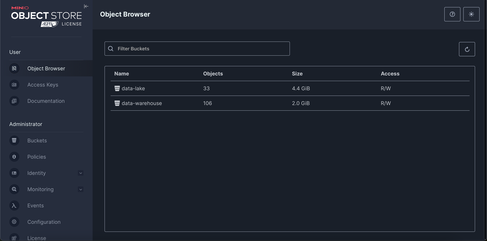

Figure 5: Minio object storage for data lake and data warehouse.

#### 🌿 Data Mart

1. **Configuration**

The way I setup datamart is in `docker-compose.batch.yaml` file, service name `datamart_db` where PostgreSQL is used as a database for datamart.

Similar to Minio, I bind local host path to service `./local/volumes/datamart_db` so that data could persist for development. Service is opened on port 5434, and other info you could see in environment file. You could connect to datamart via any database Connection Software (e.g DBeaver).

After connecting to database, I create three tables for each data sources. Below code is the SQL Green Taxi tables. You could locate other Table’s SQL at `batch_processing/database/sql/datamart`.

```sql
CREATE TABLE green_taxi_mart (
    pickup_datetime TIMESTAMP,
    dropoff_datetime TIMESTAMP,
    trip_miles NUMERIC(10, 2),
    pulocationid INTEGER,
    dolocationid INTEGER,
    passenger_count INTEGER,
    fare_amount NUMERIC(10, 2)
) PARTITION BY RANGE (pickup_datetime);

CREATE TABLE green_taxi_mart_default PARTITION OF green_taxi_mart
    DEFAULT;
```

b. Partitioning

Since NYC taxi dataset is pretty large (several GB for each month), and update monthly (data organizes in month on website), I decide to partition the table for Green, Yellow, and Fore-hire-vehicle by month as well. To be more specific, I use `range partitioning` on `pickup_datetime` to forward record for their corresponding month’s partition.

```sql
CREATE TABLE green_taxi_mart (
    pickup_datetime TIMESTAMP,
        ...
) PARTITION BY RANGE (pickup_datetime);

// Example only, you don't have to create this partition
CREATE TABLE green_taxi_mart_2025_07 PARTITION OF green_taxi_mart
    FOR VALUES FROM ('2025-07-01') TO ('2025-08-01');
    
CREATE TABLE green_taxi_mart_default PARTITION OF green_taxi_mart
    DEFAULT;
```

*(\*) Note: In the orchestration’s workflow, I have created a task that would check and create corresponding partition for the data.*

c. Other

There would be a table for online feature. This table would be automatically created by Kafka connector. For illustration purpose, I add the table schemas for online feature table below:

<!-- TODO: Add table sql for online feature table. -->

#### 🌿 Trino Query Engine

📔 **What does It use for?**

Trino is a distributed query engine that is used widely in the industry. In my system, beside the ability to scale, I mainly use it for connecting to various data system, namely Parquet on Minio and PostgrSQL. Therefore, the development team doesn’t have to use multiple query tools (e.g Spark Client for Minio’s parquet, Postgre client) but through an unified engine. It also facilitates for Devops or Database Administrators to track, monitor the query request.

🛠️ **Configuration**

Trino platform contains three components, where its configuration could be observed in `docker-compose.batch.yaml`: 1) Trino Query Engine itself. b) Hive-metastore, c) metastore-db.

Trino requires hive-metastore to save it metadata related to source that it connect to. For example, connection information to S3-minio, PostgreSQL. Hive-metastore saves its data in metastore-db (a postgresql)

In order to make Trino know S3-minio connection information, I create a property file `local/trino/catalog/dwh.properties` , and mount this file to `/etc/trino/catalog`.

Currently, I host Trino in a standalone mode (single app shared both as Trino master and worker). In production, a further step that splits Trino’s master and worker is required.

Finally, you could verify Trino via database connection software such as DBeaver.

<!-- - TODO: Currently, I couldn’t visualize our parquet file via Trino. To visualize it, it seems that we need to write sql that define table schemas, path to parquet for Trino. Where script I have forgotten -->

### 🌿 Spark Cluster

📔 **Overview**

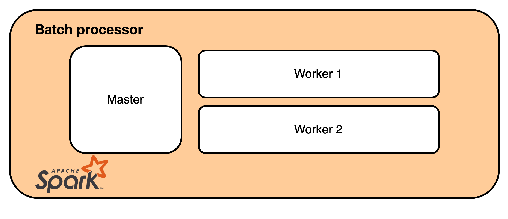

Figure 6: Spark cluster component.

Spark is a distributed compute engine maintained by Apache. In our system, I host a spark cluster handle computation from tasks that are submitted by Airflow.

Specifically, Spark cluster contains two main components: 1) a master service that monitors, receives, and distribute task to worker, 2) Worker that mainly carries out the task. 

🛠️ **Configuration**

The way I setup Spark cluster is in `docker-compose.batch.yaml`, service `spark-master` and `spark-worker` . Those base on custom image (`local/spark/Dockerfile`) a shared image: `apache/spark:4.0.2-java21` but I further run a script that can automatically run spark master, worker automatically.

If it starts successfully, you could visualize spark monitoring dashboard at `localhost:8080`

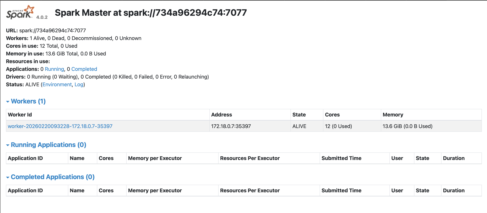

Figure 7: Spark monitoring dashboard.

*(\*) Note: For the development purpose, I only use a single worker. Feel free to add more workers if you need.*

🚃 **Implementation details**

At data warehouse stage, I do several tasks:

- Filling default value for missing fields.
- Categorize/Format values to our values for clarity. E.g for green data’s trip type, I transform index (1, 2) into meaningful string (STREET_HAIL, DISPATCH).
- Create new features: e.g trip_duration_seconds is computed from pickup_datetime and dropoff_datetime.
- Drop unused columns: e.g ehail_fee in Green Taxi.

For more information, you could see at (`batch_processing/datawarehouse`). At datamart stage, I do:

- Filtering out only valid records: 1) records with trip durations > 100s or 2) trip_miles > 0, and 3) client has paid for the trip (fare_amount), 4) pickup_datetime is not null.
- Drop duplicate records.
- Select only informative features.

For more information, you could see at (`batch_processing/datamart`).

🔥 **Utilizing built-in function**

For every step, I use built-in function in PySpark without any custom function to facilitate computation speed. Moreover, all operation is lazy (there is no join or group by operation) so Spark planning could optimize task for whole pipeline.

🚕 **Connecting to data storage**

Spark supports several package to connect to S3-Minio or PostgreSQL. I setup Spark to connect to these sources without requiring additional code or storage to store intermediate result.

```python
def create_spark_session() -> SparkSession:
    """
    Create a Spark session with the specified configuration.
    """
    JAR_DIR = "jars"
    jars = f"{JAR_DIR}/hadoop-aws-3.4.1.jar,{JAR_DIR}/bundle-2.32.24.jar,{JAR_DIR}/postgresql-42.7.7.jar"
    builder: SparkSession.Builder = SparkSession.builder\
        .appName(settings.spark_app_name) \
        .master(settings.spark_master) \
        .config('spark.memory.fraction', '0.6')\
        .config("spark.executor.memory", "2g")\
        .config("spark.driver.memory", "2g") \
        .config('spark.hadoop.fs.s3a.endpoint', settings.minio_endpoint)\
        .config('spark.hadoop.fs.s3a.access.key', settings.minio_access_key)\
        .config('spark.hadoop.fs.s3a.secret.key', settings.minio_secret_key)\
        .config('spark.hadoop.fs.s3a.path.style.access', 'true')\
        .config('spark.hadoop.fs.s3a.impl', 'org.apache.hadoop.fs.s3a.S3AFileSystem')\
        .config('spark.hadoop.fs.s3a.connection.ssl.enabled', str(settings.minio_secure).lower())\
        .config('spark.jars', jars)

    spark = builder.getOrCreate()
    
    # Check spark session is created successfully
    if spark is None:
        raise Exception("Failed to create Spark session.")

    return spark
```

#### 🌿 Airflow

📔 **Overview**: 

Airflow is an orchestration platform that is widely used in the industry. In our system, I use it as an orchestration platform to run offline data pipeline. 

🛠️ **Configuration**

I currently use Airflow version 3.1.7, the recently up-to-date version of Airflow. By default, Airflow binds three volumes to local host. We only need to care about volume dag binding at `airflow/dags` folder. This is the place where I put all dags code.

If you run Airflow successfully, you could access Airflow at [`localhost:8085`](http://localhost:8085) . The login information is `airflow` for both username and password.

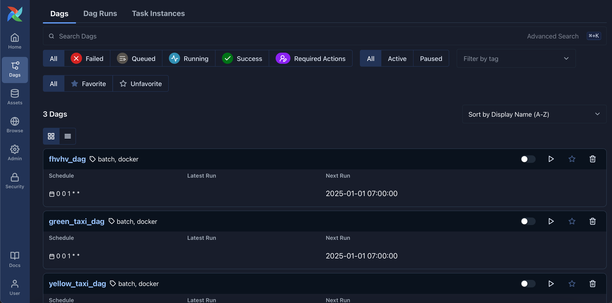

Figure 8: Airflow’s DAG Dashboard

Since task within pipeline bases on 🐋 **DockerOperator**, please build the docker image so that it can use by run the command:

```bash
cd batch_processing
docker build -t doan-batch_processor:latest .
```

To run pipeline for a source for a whole 2025, click a dag (e.g green_taxi_dag), click Trigger (top right), select options in the figure below:

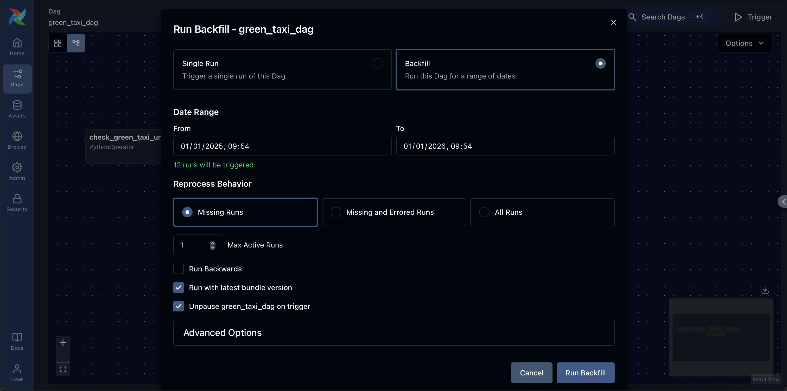

Figure 9: Airflow backfilling for Green Taxi DAG in 2025.

After that, Airflow would schedule and run backfill for every month in 2025 for Green Source.

❓ **Single or multiple pipelines**: 

First of all, I create a pipeline for each data source for several reasons. Compared to merging a tasks of all source within a pipeline, I found that this bring several benefits:

1. **clarity**: We could design task for each source in details without overwhelming a whole big pipeline.
2. Re-run facilitation: We could trigger pipeline for each source independently.
3. Easing for scheduling: If website uploads data for each source at different time of month, splitting them allow us to schedule each pipeline independently.
4. Monitoring: We could view which source’s pipeline has problems, instead of looking into a single big pipeline.
5. Space for development: Airflow allows us to merge result from multiple pipeline it we require.

**❓ Single or multiple tasks**

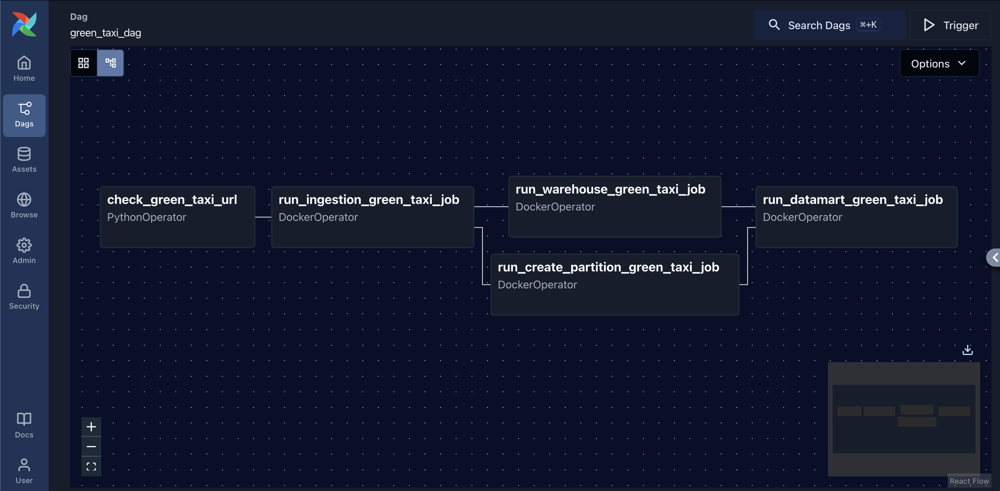

Figure 10: Splitting pipeline into multiple steps helps us design a complex pipeline.

Second, I consider whether I should merge tasks to single unified one, or split them for clarity. Compared to merging, I found that splitting them by its responsibility bringing us several benefits:

1. Facilitating for retrying task: If a task within a pipeline fail (e.g intermediate task), instead of running a whole pipeline (e.g ingestion, then computation), we only need to retry that task and continue.
2. Facilitating for monitoring: Airflow internally monitors task’s status (number of success, fail, or running). Splitting task helps us analyze tasks’s statistics, predict errors, and give probable solution on time.
3. Adding additional steps: What if we should extend pipeline features (e.g adding data validating, security check)? Merging task requires us to update the code (what if we don’t maintain the code) while adding a single task, update dependencies between tasks is more preferable.

**❓ Scheduling**

Finally, which date time should I run the pipeline? I decide to **schedule pipeline monthly** for several reason:

1. Data of each source is updated by month [Figure](assets/section3/image7.png).
2. Development team could run a single month for testing purposes.
3. Airflow allows us to run backfilling if we need (e.g Development team updates new transformation code). 

To do this, I setup schedule parameter in DAG:

```python
with DAG(
    dag_id="green_taxi_dag",
    default_args=default_args,
    description="Run green taxi batch job via Docker",
    start_date=datetime(2025, 1, 1),
    schedule="@monthly",
    catchup=True,
    tags=["batch", "docker"],
) as dag:
```

Figure: NYC taxi dataset for each taxi types in 2025

*(\*) If we know, the date the source is uploaded, we could further specify the date to run DAG.*

🚞 **Pipeline’s tasks**

For each pipeline, I create 4 tasks:

| **Task name** | **Description** | **Operator** |
| --- | --- | --- |
| Check X url | Check whether the data of that day have been uploaded. | PythonOperator |
| run_ingestion_X | Check parquet have already exist in data lake. If not, download data from website, and upload it to data lake. | DockerOperator |
| run_warehouse_X | Run Spark code that read data from Minio data-lake bucket, compute, and insert back to data-warehouse bucket. | DockerOperator |
| run_create_partition_X | We create a partition for schedule month for that source in data mart. | DockerOperator |
| run_datamart_X | Run Spark code that read data from Minio data-warehouse bucket, compute and insert into created partition in data mart. | DockerOperator |


## Section 4: Online Pipeline

### Data Sources

#### 📔 **Overview**

To enable real-time online feature computation, a data engineer must first ensure the source system also update data in real-time, e.g inserting records constantly into a database. Therefore, we host common databases widely used in industry to simulate this scenarios.

Moreover, the providers may already have their owned database, for example:

- PostgreSQL: Most common relational database, handle for different use cases.
- MongoDB: Common high-performance Document database.
- Cassandra: Write-heavy database.

In our system, I also use these databases for different data sources, specifically:

- PostgreSQL for Green Taxi Source.
- MongoDB for Yellow Taxi Source.
- Cassandra for for-hire-vehicle Source.

#### 🛠️ **Configuration**

The way I setup these database is listed in `docker-compose.source.yaml` . Specifically:

🐘 **PostgreSQL**

I use image `postgres:15` .

I also turn on Write Ahead Log (WAL) by setting `wal_level=logical` when starting PostgreSQL to enable capture data change (CDC) latter.

🌿 **MongoDB**: 

I use image `mongodb-community-server:7.0.30-ubi9` .

To enable CDC latter, although MongoDB provides feature similar to WAL in PostgreSQL, it only activate when MongoDB is configured more than one node. Therefore, I decide to run MongoDB in Replication mode.

After  `datasource3` service (MongoDB) have been started up, run below command to execute into mongosh.

```bash
# Execute into Mongo container
docker exec -it datasource3 /bin/bash
# Run Mongosh
mongosh
```

Then, copy the content within `local/mongodb/init-replica-set.js` , and past into mongosh terminal.  The result may like this:

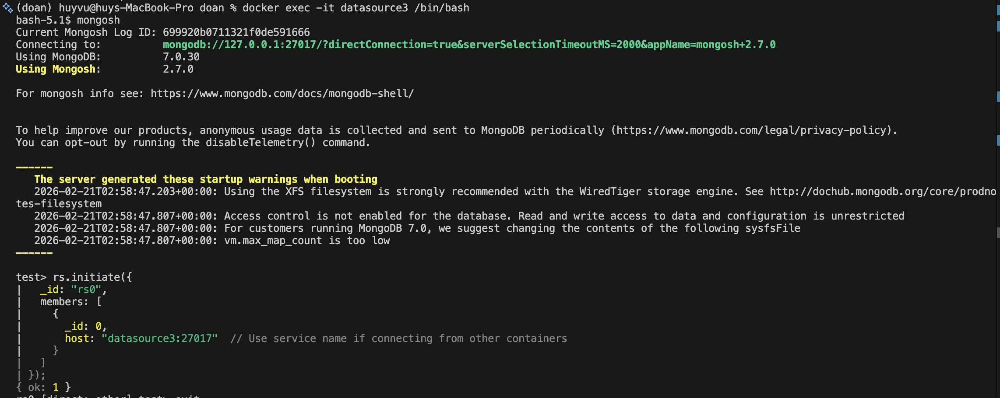
Figure 11: MongoDB replica set configuration.

In the last line, we can see: `rs0` named of the replication set, and there is a single node in this set (Primary node, accept both write, read). `datasource3:27017` means this member only accept domain name `datasource3` (for other container connect to).

[Optional] Visualize Mongo database: To visualize Mongo database, please install MongoDB  UI application such as MongoDB compass.  Moreover, since the replication only accept `datasource3` domain name, I use a trick that map [localhost](http://localhost) IP address `127.0.0.1` to `datasource3` . In production, a DNS should be use instead. Please go to `/etc/hosts`  and add the line below: 

```jsx
127.0.0.1       datasource
```

After that, you can connect to MongoDB database:

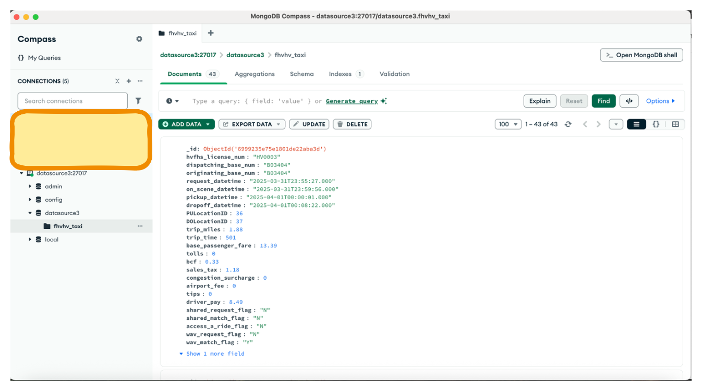

Figure 12: Visualization of MongoDB.

👁️ **Cassandra**:

Cassandra is a **write-heavy** database - thanks to its Log-structured merge-tree as its core data structure -  and also supports to distributed transaction pretty well. Therefore, Cassandra always in the top list of database when it comes to write-intensive app such as Log (traces), or in our cases. 

In this setting, I use image `debezium/example-cassandra:3.1.3.Final` . This is an image based on `cassandra:4.0` but I also install Debezium for CDC that I would discuss in more detail latter.

To visualize Cassandra, one option is to use Trino. If you have start Trino by running `docker-compose.batch.yaml`, you may use access Trino through DBeaver to visualize Cassandra database:

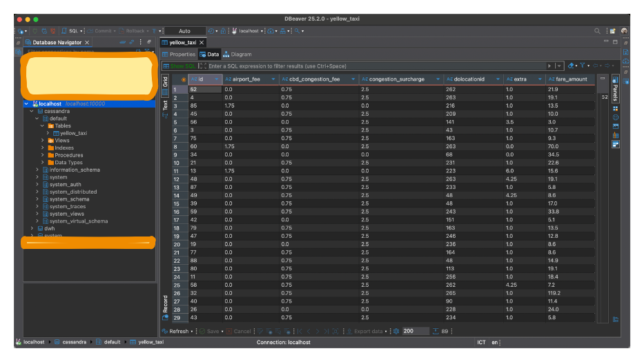

Figure 13: Cassandra visualization through Trino.

*(\*) Note: To make Trino know the connection information to Cassandra, I create a config file at `local/trino/catalog/cassandra.properties` and mount it into `/etc/trino/catalog`.*

#### 🏭 Data Generator

In `docker-compose.source.yaml` , there are three additional services named `x_generator`  which is a service that constantly insert record into these database. You may find more information about these services at `./local/generator`.

### Debezium Connectors

#### 📔 Overview

Given that records have been updated constantly into some databases, we then capture these records using any platform that supports feature: Capture Data Change (CDC). One popular platform is Debezium, which I also use in our system.

During development, we found several challenges when enabling these features:

1. **Data content captured by Debezium is different between database**: Currently, Debezium provides CDC feature by reading the logs of a database. Since the info writes to the log in different database is different. For example, while Debezium can infer and parse captured data in PostgreSQL into write format, those for MongoDB is only a json string.
2. **The Debezium’s package supports for different database is mature in different levels**: I found that PostgreSQL is the most mature, where efficient compression technique like Arvo is support, it is not for MongoDB and Cassandra.
3. **The way to host Debezium’s engine to enable CDC is also different in databases**: While PostgreSQL and MongoDB run Debezium CDC plugins within Debezium engine service, Cassandra requires Debezium CDC engine to run as an independent java application.

In the section below, we would discuss how to setup Debezium CDC in details:

#### Configuration

🐘 **PostgreSQL &** 🌿 **MongoDB CDC**

Before running CDC for these two database, I host a Debezium service within in `docker-compose.stream.yaml` , service `debezium`. Basically, Debezium needs to connect to Kafka Message queue, so that it can insert message captured to a Kafka topic. This is set through an environment variable: `BOOTSTRAP_SERVERS`.

Moreover, I also configure Debezium to allow AvroConverter by:

1. Set `KEY_CONVERTER` and `VALUE_CONVERTER` to `io.confluent.connect.avro.AvroConverter`
2. Set Env variables to connect Debezium to Schema Registry.
3. Provide Debezium with required java packages at `./jars/debezium_plugins`.

Since Debezium has already had built-in CDC packages for PostgreSQL and MongoDB, there is not need to install.

 After that, I submit PostgreSQL and MongoDB CDC configuration files through service `debezium-init` . You may find more information about these files at `local/debezium`.

👁️ **Cassandra**:

Compared to PostgreSQL and MongoDB, CDC package for Cassandra needs to additionally install and run independently. For Cassandra 4.0, I found CDC package version `2.7.4.Final` is compatible with it. 

All configuration file is located at `local/cassandra` . Specially, several steps need to be done include:

1. Update Cassandra configuration file `cassandra.yaml` to enable cdc capture: `cdc_enabled: true`.
2. Configure Cassandra CDC app (e.g Kafka broker, Cassandra connection info, etc) with `config.properties` 

After that, a script name `startup-script.sh` I wrote to run Cassandra database and CDC sequentially.

#### 💻 Compression Method

In production, compression method such as Avro enable lower storage cost as well as leverage encoding/decoding speed compared to JSON. 

During development, I found that PostgreSQL can effortlessly enable these features. In PostgreSQL CDC config, I setup Avro Converter for captured data.

However, when it comes to MongoDB and Cassandra, it’s another story. I could summarize like this:

- Avro Formatter is supported, but outdated, and it hasn’t updated into new CDC package.
- CDC package has successfully encode data with Arvo, but does it encode correctly? And can consumer (in my case, Flink) able to parse the encoded data from the given schemas.

After several experiments, I decide not to use Avro for MongoDB and Cassandra, but JSON format for simplicity.

### Stream Computation

#### 📔 **Overview**

For stream computation, we use Flink - A distributed platform dedicated for stream computation. Compared to python service, Flink brings several advantages:

1. **Parallel computation**: Given a single complex task, Flink can plan (like Spark) and distribute tasks to multiple nodes to handle computation. In contrast, it is up to Python service to do all these work.
2. **Robust checkpointing mechanism**: Python service may relies Kafka Offsets mechanism to remember which messages have been read, which limited its computation capabilities (e.g aggregating multiple messages in Window). With its owned checkpoint mechanism, it is not the case for Flink.
3. **Support Window Aggregation**: Window Aggregation is a complex operation in event streaming platform. It should consider cases such as the delay of event, discriminate suitable events for this window, managing window state, etc.  

In our system, we implement the computation workflow for each data source illustrated in the figure below:

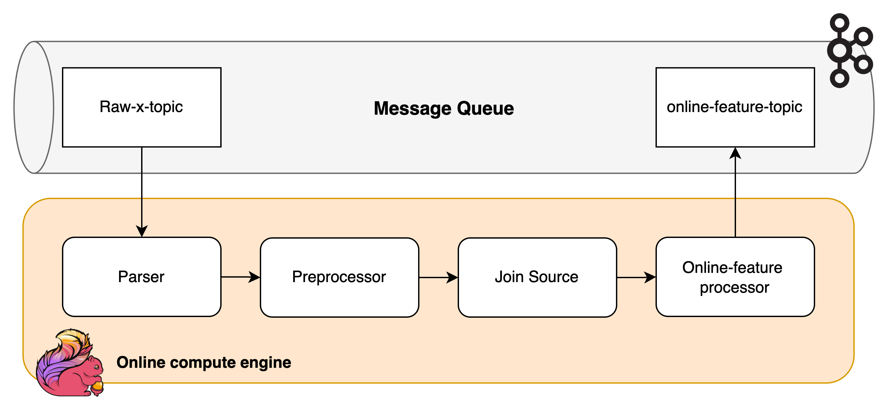

Figure 14: Computation workflow of Flink.

1. **Parser**: For each data source within raw-x-topic, a parser that parse raw data extract from CDC into our desired format. For example, Avro parser for Green Taxi (PostgreSQL), String parser for Yellow Taxi (MongoDB), and Json parser for For-hire-vehicle (Cassandra). We also setup Watermark for data source to enable Window Aggregation operation.
2. Preprocessor: After parsing data into write format, we then preprocess each data source such as 1) Fill in missing values, 2) format data value (e.g index 1, 2 to meaningful string value), 2) Drop unused columns.
3. Join Source: Given each source, we join them together, construct a single unified table for all sources, prepare for online feature computation.
4. Online-feature processor: We compute online features that we have discussed in the DataSource section.
5. Finally, we insert online feature back into Kafka topic `online-feature-topic`.

The implementation details is listed at `stream_processing` .

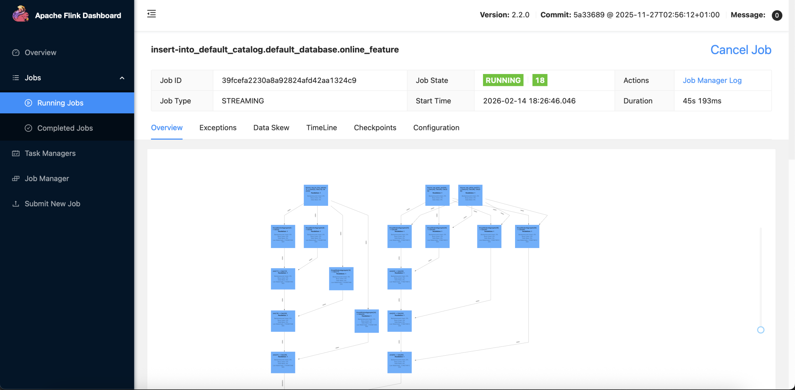

Figure 15: Flink Monitoring Dashboard.

#### 🏠 Flink cluster

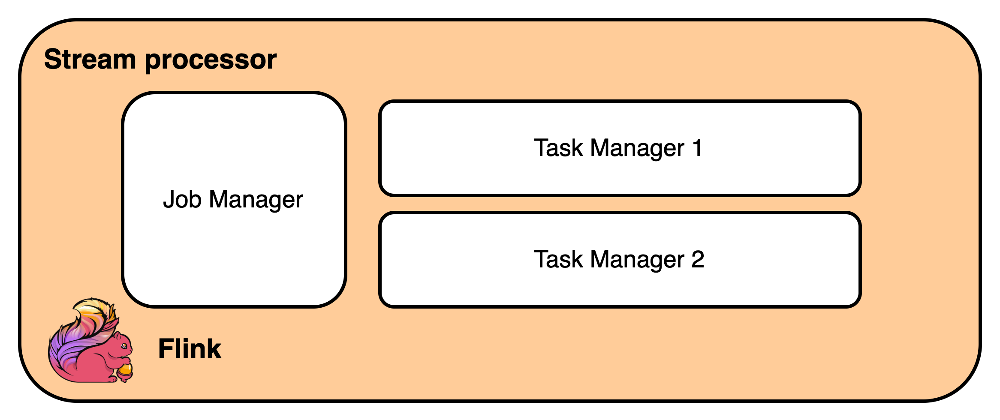
Figure 16: Flink cluster architecture.

I host a Flink cluster, specified at `docker-compose.stream.yaml` , service `flink-jobmanager` and `flink-taskmanager`  both shared image `flink:2.2.0-java21`. 

- Job Manager: Receive submitted Flink Job, manage state, checkpoint, planning, distributed tasks to Task Manager.
- Task Manager: Do the Flink’s task.

  

#### 🛠️ Built-in Flink Operation

In our Flink code, I use all built-in Flink function, from if-else condition, joining, data parsing, etc without any custom function to enable high-performance Flink computation. I believe these code’s files are a good reference for those who one to build Flink with Python since during our development, the reference code is somehow limited.

### Sink Connectors
Finally, given a online-feature computed by Flink, I configure Kafka Sink Connectors to insert records into online-feature table in PostgreSQL datamart. Kafka Sink Connectors would automatically create a table if it doesn’t exist. The configuration file is located at `local/debezium/postgresql_sink.json`

```json
{
  "name": "online-feature-sink",
  "config": {
      "name": "online-feature-sink",
      "connector.class": "io.confluent.connect.jdbc.JdbcSinkConnector",
      "connection.url": "jdbc:postgresql://datamart_db:5432/datamart",
      "connection.user": "datamart_user",
      "connection.password": "datamart_password",
      "topics": "online-feature"
  }
}
```

## Section 5: Conclusion
In this project, we have designed and implemented a data pipeline that can handle both offline and online data processing for the NYC Taxi dataset. The system is designed to be scalable, maintainable, and efficient, leveraging modern technologies such as Apache Spark for batch processing and Apache Flink for stream processing.

## Reference
1. [NYC Taxi Dataset](https://www1.nyc.gov/site/tlc/about/tlc-trip-record-data.page)
2. [Debezium](https://debezium.io/)
3. [Apache Flink](https://flink.apache.org/)
4. [Apache Spark](https://spark.apache.org/)
5. [Apache Airflow](https://airflow.apache.org/)
6. [Trino](https://trino.io/)
7. [Minio](https://min.io/)
8. [PostgreSQL](https://www.postgresql.org/)