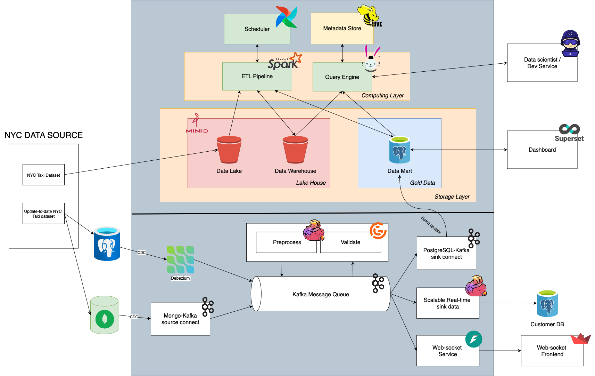

# NYC Data Processing Pipeline

# Install dependency
uv sync --extra spark
uv sync --extra flink

# Streaming pipeline
## 1. Register connector to Debezium
./local/debezium/run.sh register_connector ./local/debezium/datasource1-cdc.json
./local/debezium/run.sh register_connector ./local/debezium/datasource2-cdc.json
./local/debezium/run.sh register_connector ./local/debezium/datasource3-cdc.json

## 2. Generate data
python3 -m local.generator.datasource1_generator
python3 -m local.generator.datasource2_generator
python3 -m local.generator.datasource3_generator
python3 -m local.generator.kafka_generator